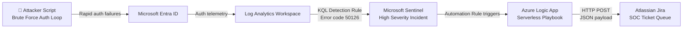

# ⚡ Cloud-Native SOAR Pipeline — Microsoft Sentinel to Jira
### *Zero-touch incident response. Detection to ticket in seconds. No analyst required.*

<p align="left">
  
  
  
  
  
  
</p>

---

## ⚡ TL;DR — What This Does

| Step | What Happens | Who Does It |
|------|-------------|-------------|
| **1** | Attacker script generates rapid Entra ID authentication failures | Attacker |
| **2** | KQL analytic rule detects brute-force pattern (Error `50126`) | Microsoft Sentinel |
| **3** | High-severity incident fires — automation rule triggers | Microsoft Sentinel |
| **4** | Serverless Logic App playbook executes | Azure |
| **5** | HTTP POST with full incident context hits Jira REST API | Logic App |
| **6** | Fully contextualised Jira ticket appears in SOC queue | Jira — Zero human touch |

> **Mean Time to Ticket: seconds. Manual analyst effort: zero.**

---

## 📖 What This Project Is

In modern SOC environments, minimising **Mean Time to Respond (MTTR)** is critical to halting lateral threat movement. Manually copying alert variables from a SIEM into an ITSM queue creates operational drag, introduces human error, and costs analyst time that should be spent on triage — not data entry.

This project demonstrates the end-to-end design, engineering, and deployment of a **zero-touch Security Orchestration, Automation, and Response (SOAR)** pipeline. By bridging **Microsoft Sentinel** with **Atlassian Jira via a custom REST API integration**, the environment autonomously detects brute-force attacks and provisions fully contextualised incident tickets — with no analyst touch required from detection to ticket.

---

## 🏗️ Architecture



**Pipeline Phases:**
- **Phase 1:** Adversarial script generates rapid Entra ID authentication failures
- **Phase 2:** Log Analytics ingests raw telemetry via native cloud connectors
- **Phase 3:** KQL analytics rule isolates error code `50126` and fires a High-severity incident
- **Phase 4:** Sentinel Automation Rule intercepts the alert and instantiates the Logic App
- **Phase 5:** Playbook parses dynamic incident data and pushes an HTTP POST to Jira REST API
- **Phase 6:** Fully contextualised ticket lands in the SOC queue — automatically

---

## 🛠️ Tech Stack

| Component | Technology | Purpose |
|-----------|-----------|---------|
| **SIEM** | Microsoft Sentinel | Threat detection + incident management |
| **Identity Provider** | Microsoft Entra ID | Auth telemetry source |
| **Log Storage** | Log Analytics Workspace | Raw event ingestion + KQL queries |
| **Automation** | Azure Logic Apps (serverless) | SOAR playbook execution |
| **ITSM** | Atlassian Jira | SOC ticket queue destination |
| **Integration** | Jira REST API + HTTP POST | Cross-platform ticket creation |
| **Detection Language** | KQL (Kusto Query Language) | Brute-force analytics rule |
| **MITRE ATT&CK** | T1110 — Brute Force | Detection framework mapping |

---

## 🚀 Build Phases

### Phase 1 — Adversarial Emulation (The Trigger)

To validate the pipeline against real-world parameters, an offensive PowerShell authentication loop was initiated — simulating a rapid password spray attack. This forced Entra ID to reject requests and populate the environment with actionable threat telemetry.


---

### Phase 2 — Cloud Infrastructure & Log Storage

A secure, sandboxed resource group was established in Azure. A Log Analytics Workspace was deployed to handle ingestion, parsing, and storage of incoming log streams.


---

### Phase 3 — SIEM Deployment & Data Connectors

Microsoft Sentinel was initialised and native data connectors mapped to the Entra ID tenant — routing critical authentication logs directly into the security matrix.


---

### Phase 4 — Detection Engineering (KQL)

Raw authentication tables were elevated to actionable intelligence. KQL detection logic was authored to isolate password failure patterns using Entra ID error code `50126` — filtering out standard operational noise.

```kusto
SigninLogs
| where ResultType == "50126"          // Invalid username or password — brute-force signal
| where TimeGenerated > ago(1h)
| summarize FailedAttempts = count() by UserPrincipalName, IPAddress, Location
| where FailedAttempts > 5             // >5 accounts for normal user typos; automated sprays exceed this immediately
| project UserPrincipalName, IPAddress, Location, FailedAttempts
| order by FailedAttempts desc
```

> **Error code `50126`** = Invalid username or password — the exact signal generated by a brute-force attack against Entra ID. Filtering on this code eliminates MFA failures and conditional access blocks from the alert scope.


---

### Phase 5 — ITSM Target Setup (Jira)

Before orchestrating the automated response, the destination ITSM platform required structural preparation to securely accept programmatic external API connections.


---

### Phase 6 — SOAR Playbook Engineering (Logic App)

The automated response was built using a serverless Azure Logic App. This playbook converts incoming Sentinel webhooks into dynamic outbound REST API requests — passing heavily nested JSON payload arrays to the Jira API.

**Key engineering decisions:**
- Used the **Microsoft Sentinel incident trigger** (not alert trigger) to capture full incident context including all alert entities
- Encoded Jira API credentials as **Base64 Basic Auth** within the HTTP action header
- Mapped Sentinel dynamic fields (`IncidentName`, `Severity`, `Description`, `Tactics`) directly into the Jira issue body using Atlassian Document Format (ADF):

```json
{
  "fields": {
    "project": { "key": "SOC" },
    "summary": "High Severity Incident: @{triggerBody()?['IncidentName']}",
    "description": {
      "type": "doc",
      "version": 1,
      "content": [
        {
          "type": "paragraph",
          "content": [
            { "type": "text", "text": "Severity: @{triggerBody()?['Severity']}" }
          ]
        }
      ]
    },
    "issuetype": { "name": "Task" }
  }
}
```


---

### Phase 7 — IAM Controls & Automation Routing

RBAC permissions were assigned for autonomous execution. An orchestration routing rule was configured to fire the playbook the moment the KQL analytic rule triggered.


---

### Phase 8 — Execution Validation (The Proof)

The pipeline was validated by re-running the brute-force attack script. The system performed end-to-end without intervention.


> **HTTP 201 Created** — the Jira REST API confirmed successful ticket creation. This is the handshake that proves the full pipeline is live.


---

## 🧠 Key Engineering Decisions & Lessons Learned

### 1. Incident Trigger vs Alert Trigger
Sentinel offers both as Logic App triggers. The **incident trigger** was chosen because it captures the full aggregated context — all entities, all alerts, all tactics mapped — whereas the alert trigger only captures a single alert's data. For a Jira ticket to be actionable, it needs the full picture.

### 2. JSON Payload Depth
The Jira REST API v3 uses Atlassian Document Format (ADF) for issue descriptions — a deeply nested JSON structure. Mapping Sentinel's dynamic content into ADF required careful `compose` actions in the Logic App to build the payload correctly before the HTTP POST step.

> **Production note:** Jira API credentials were encoded as Base64 Basic Auth in the HTTP action header — acceptable for a lab environment. In a production deployment, these credentials would be migrated to **Azure Key Vault** and accessed via a **Managed Identity** to eliminate hardcoded secrets entirely.

### 3. RBAC is Non-Negotiable
The Logic App requires the **Microsoft Sentinel Responder** role on the workspace to read incident data. Without this, the playbook fires but returns a 403 on every data fetch. Least-privilege assignment was documented and applied.

### 4. Real-World SOC Value
This pipeline directly reduces **Mean Time to Respond (MTTR)**. In a manual workflow, an analyst must: notice the alert, open Sentinel, read the incident, open Jira, create a ticket, copy across all context. With this pipeline: zero steps. The ticket exists before the analyst opens their laptop.

---

## 🔮 What's Next

- **Bi-directional sync** — update Sentinel incident status when Jira ticket is resolved
- **Entity enrichment** — query AbuseIPDB or VirusTotal before ticket creation and include threat intel score in the Jira description
- **🤖 AI-Driven Triage** — pilot **IBM watsonx Orchestrate** agents to autonomously classify incident severity, enrich with threat intelligence, and route to the correct Jira queue based on attack type — before any human touches the ticket

---

## 📁 Repository Structure

```
azure-sentinel-jira-soar-pipeline/
├── images/
│   ├── 00-attack-simulation-brute-force.png
│   ├── 01-resource-group-created.png
│   ├── 02-resource-group-creation-form.png
│   ├── 03-log-analytics-workspace-created.png
│   ├── 04-microsoft-sentinel-enabled.png
│   ├── 05-sentinel-workspace-connected-to-defender.png
│   ├── 06-defender-data-connectors-entra-visible.png
│   ├── 07-entra-id-connector-configuration.png
│   ├── 08-entra-data-ingestion-confirmed.png
│   ├── 09-auditlogs-query-results.png
│   ├── 10-failed-signin-kql-live-results.png
│   ├── 11-analytics-rule-created.png
│   ├── 12-analytics-rule-simulation-results.png
│   ├── 13-jira-project-created.png
│   ├── 14-jira-api-token-created.png
│   ├── 15-logic-app-playbook-created.png
│   ├── 16-sentinel-incident-trigger-configured.png
│   ├── 17-logic-app-http-action-jira-configured.png
│   ├── 18-azuresentinel-api-connection-authorized.png
│   ├── 19-sentinel-automation-rule-created.png
│   ├── 20-sentinel-logic-app-permission-granted.png
│   ├── 21-sentinel-incidents-created.png
│   ├── 22-playbook-triggered-successfully.png
│   ├── 22b-logic-app-run-history-success.png
│   ├── 23-jira-ticket-auto-created.png
│   ├── 23b-jira-ticket-details-mapped.png
│   └── 24-automation-rule-active-confirmed.png
└── README.md
```

---

## 🔗 Related Projects

| Project | Description |
|---------|-------------|
| [Dual SIEM Detection Lab](https://github.com/shank078/Dual-SIEM-Detection-Lab) | 5 MITRE-mapped detections across Sentinel + Splunk on live attacker traffic |
| [Azure Sentinel Honeypot SIEM](https://github.com/shank078/azure-sentinel-honeypot-siem) | 1,400+ real brute-force attempts captured and mapped globally |
| [Azure Identity Security Lab](https://github.com/shank078/azure-identity-security-lab) | Full red/blue team MFA compromise and IR cycle |

---

## 👤 About the Author

**Shankar Baral** — Junior Cyber Security Analyst & IT Support Specialist
Master of Information Technology (Cyber Security) · GPA 4.92 · Australian Permanent Resident · Canberra, ACT

[](https://linkedin.com/in/shankarbaral1)
[](https://github.com/shank078)
[](mailto:shankarbaral1@gmail.com)

*Open to Junior SOC Analyst and Security Engineer opportunities in Australia.*

---

> *The best incident response is the one that starts before the analyst opens their laptop.*
